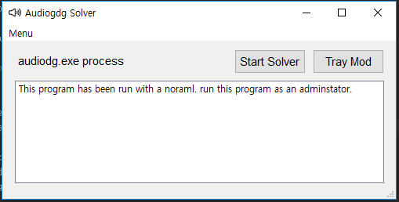
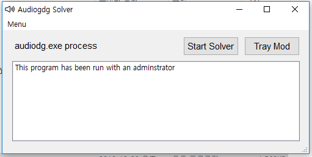
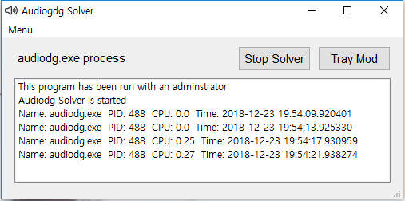

# AudiodgSolver
Audiodg Solver solves audiodg.exe process bugs

# How to use this

Firstly, Download Audiodg Solver at the Link.

( Link: https://drive.google.com/ucauthuser=0&id=1hBdsRpIdK76ZO9JOEFGhDGxcW6REpeo0&export=download ) 

after downloading, decompress the AudiodgSolver.zip and execute audiodgsolver.exe

you should run this as an adminstrator If not this can't solve the audiodg.exe process bug.

This screen shows the normal condition.

Click the "Start Solver" then this solves audiodg.exe process bug.

This manage the audiodg.exe process.

If you want to minimize this you can use the traymod by clicking the "Tray Mod" button.

Minimized Program

# Logic Solveing Audiodg.exe Porcess Bug 

* 1. Detect the audiodg.exe process within user's process list
* 2. Find the audiodg.exe process PID
* 3. Measure CPU of the PID
* 4. If CPU of the PID exceeded the 6% share This kill the process
* 5. Automatically running the audiodg.exe process again
